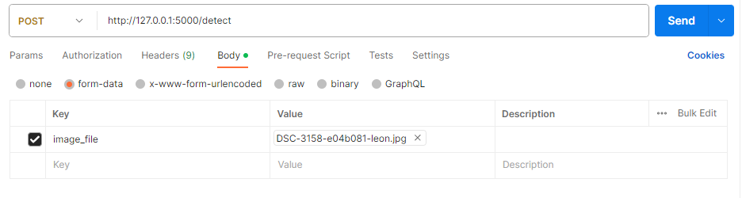

# Object Detection Using Yolov8 
Object Detection Using Yolov8 will take the image as input and return the objects and thier probability as Json response.
## Setup
  ```code
  conda create -n <env_name>
  conda activate <env_name>
  git clone https://github.com/USTAADCOM/Internship_task_repo.git
  cd Python_basic_27_07_2023
  pip install -r requirements.txt
  ```
## Project Structure
```bash
Python_Basic_27_07_2023
   │   app.py
   │   best.pt
   │   DSC-3158-e04b081-leon.jpg
   │   image-1.png
   │   image.png
   │   README.md
   │   requirements.txt
   │   yolov8n.pt
   └───modules
        predict_module.py
```

## Word Counter 
Payload
Form Data
```code
Key: image_file  value: Image path
```
Header 
```code
key: api-key     value: pakistan
```
 
Response 
```code
{
    "object1": {
        "confidence": 0.89,
        "object": "person",
        "shape_box": [
            254,
            206,
            896,
            1664
        ]
    }
}
```

